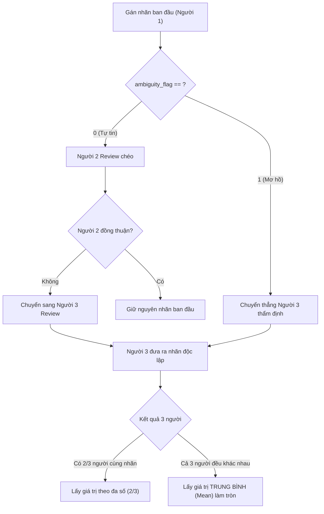

# BỘ QUY TẮC GÁN NHÃN DỮ LIỆU (ANNOTATION GUIDELINE)
**Dự án:** NT120 - Gán nhãn Sắc thái (Sentiment) & Độ độc hại (Toxicity)  
**Đối tượng thực hiện:** Ân, Đại, Huy  

---

## I. CẤU TRÚC DỮ LIỆU
Mỗi file dữ liệu gồm 4 cột:
1. `Comment`: Nội dung văn bản bình luận (**Tuyệt đối không chỉnh sửa nội dung gốc**).
2. `Sentiment`: Nhãn sắc thái cảm xúc (`-1`, `0`, `1`).
3. `Toxicity`: Mức độ độc hại (`0`, `1`, `2`, `3`).
4. `ambiguity_flag`: Cờ đánh dấu độ mơ hồ/khó xác định (`0`, `1`).

---

## II. QUY TẮC GÁN NHÃN SẮC THÁI (SENTIMENT)

| Giá trị | Trạng thái | Định nghĩa & Tiêu chí nhận biết | Ví dụ minh họa |
| :---: | :--- | :--- | :--- |
| **`-1`** | **Tiêu cực (Negative)** | - Thể hiện sự chê bai, bất bình, tức giận, thất vọng, phàn nàn, buồn bã. - Mỉa mai, châm biếm mang hàm ý tiêu cực. - Lên án hành vi, thái độ, sự việc. | - *"Mỹ đã tuột dốc quá nhiều rồi."* - *"Thật chán với chế độ quản lý dân sinh."* - *"Đúng là đỉnh cao của sự lươn lẹo!"* |
| **`0`** | **Trung tính / Cung cấp thông tin / Không rõ ràng** | - Trần thuật khách quan, trích dẫn, chia sẻ sự thật/tin tức, đặt câu hỏi thuần túy. - Cảm xúc lẫn lộn (vừa khen vừa chê cân bằng). - Câu cụt lủn, vô thưởng vô phạt không rõ sắc thái. | - *"Dàn Táo năm nay phát sóng 9h tối 23 Tết trên VTV3."* - *"Coronavirus is manmade."* - *"Chỗ này bán mấy giờ vậy bạn?"* |
| **`1`** | **Tích cực (Positive)** | - Khen ngợi, cảm kích, yêu thích, khích lệ, ủng hộ, hài lòng. - Chúc mừng, thể hiện tình cảm ấm áp, tự hào. - Dùng từ ngữ/emoji thể hiện niềm vui. | - *"Thật tuyệt vời...!!!"* - *"VN luôn tự hào!"* - *"Em reaction quá hay quá cute coi hợp lí ghê."* |

---

## III. QUY TẮC GÁN NHÃN ĐỘ ĐỘC HẠI (TOXICITY)

| Mức độ | Định nghĩa | Tiêu chí chi tiết | Ví dụ minh họa |
| :---: | :--- | :--- | :--- |
| **`0`** | **Không độc hại (Clean / Non-toxic)** | - Ngôn ngữ lịch sự hoặc giao tiếp bình thường. - Tranh luận văn minh, phản biện quan điểm không công kích cá nhân. - Thể hiện cảm xúc tiêu cực nhưng không dùng từ ngữ xúc phạm hay hạ nhục. | - *"Tôi không đồng tình với ý kiến này."* - *"Giá xe hơi ở VN quá đắt so với thu nhập."* - *"Buồn cho thế hệ trẻ ngày nay."* |
| **`1`** | **Độc hại nhẹ / Bất lịch sự (Mild / Impolite)** | - Chửi thề buột miệng, từ đệm tục tĩu dùng làm cảm thán tự nhiên không nhắm vào ai cụ thể. - Mỉa mai cộc cằn, thô lỗ, thiếu tôn trọng nhưng chưa đến mức thóa mạ nhân phẩm. | - *"Vãi cả lúa, làm ăn như hạch."* - *"Cay vl thế không biết."* - *"Mắc mớ gì mà sủa hoài vậy ba."* |
| **`2`** | **Độc hại vừa / Xúc phạm & Công kích (Insulting / Offensive)** | - Công kích cá nhân (*ad hominem*), miệt thị ngoại hình (*body shaming*), xúc phạm trí tuệ, nhân phẩm của đối tượng cụ thể. - Dùng danh xưng hạ nhục, chửi rủa đối tượng trực tiếp. | - *"Thằng này mặt dày như thớt, vừa ngu vừa lì."* - *"Nhìn tướng con này như con heo nọc."* - *"Mài có óc để suy nghĩ không hả thằng ngu?"* |
| **`3`** | **Độc hại nặng / Thù ghét & Đe dọa (Hate Speech / Severe)** | - Phân biệt vùng miền, sắc tộc, tôn giáo, giới tính, khuyết tật mang tính kỳ thị hệ thống. - Đe dọa bạo lực, kích động trả thù, kêu gọi giết/đánh người. - Xúc phạm gia quyến thô bỉ, trù ẻo cái chết, ngôn từ cực đoan. | - *"Lũ bắc kì/nam kỳ mọi rợ cần phải bị tiêu diệt."* - *"Thứ này phải cho dựa cột bắn bỏ/chém chết."* - *"Đm cả lò nhà mày chết hết đi."* |

---

## IV. QUY TẮC GÁN NHÃN `ambiguity_flag`

- **`0` (Rõ ràng / Tự tin):** Người gán nhãn hiểu rõ ngữ cảnh, sắc thái rõ ràng, tự tin vào lựa chọn `Sentiment` và `Toxicity`.
- **`1` (Mơ hồ / Không chắc chắn):** 
  - Bình luận dùng tiếng lóng khó hiểu, teencode tối nghĩa.
  - Châm biếm/mỉa mai quá thâm sâu không dám chắc là khen hay mỉa.
  - Ngữ cảnh phụ thuộc vào bài viết gốc mà không thể suy luận chắc chắn từ câu nói.
  - Lưỡng lự giữa 2 mức (ví dụ phân vân giữa mức `1` và `2` của Toxicity).

---

## V. QUY TRÌNH REVIEW CHÉO VÀ GIẢI QUYẾT BẤT ĐỒNG

### 1. Phân công review chéo luân phiên
Để công bằng và khách quan, quy ước review chéo như sau:
- Tập của **An** $\rightarrow$ **Dai** review chéo $\rightarrow$ **Huy** là trọng tài thứ 3.
- Tập của **Dai** $\rightarrow$ **Huy** review chéo $\rightarrow$ **An** là trọng tài thứ 3.
- Tập của **Huy** $\rightarrow$ **An** review chéo $\rightarrow$ **Dai** là trọng tài thứ 3.

### 2. Xử lý cụ thể theo `ambiguity_flag`
1. **Khi `ambiguity_flag = 0`:**
   - Người review chéo (Người 2) kiểm tra lại các cột `Sentiment` và `Toxicity`.
   - **Đồng thuận:** Giữ nguyên giá trị ban đầu.
   - **Không đồng thuận:** Chuyển comment cho Người 3 thực hiện review độc lập mà không tiết lộ tranh chấp trước đó.
2. **Khi `ambiguity_flag = 1`:**
   - Chuyển thẳng sang Người 3 hoặc đưa vào danh sách thảo luận nhóm vì chính người gán đầu tiên đã thấy mơ hồ.

### 3. Nguyên tắc chốt kết quả (Consensus Rules)
- **Đa số (Majority Vote):** Nếu có ít nhất **2 trong 3 người** chọn cùng một giá trị $\rightarrow$ Lấy giá trị đó.
- **Bất đồng hoàn toàn (Cả 3 người khác nhau):**
  - Tính **giá trị trung bình cộng (Mean)** của 3 người, làm tròn đến số nguyên gần nhất:
    $$\text{Giá trị cuối} = \text{round}\left(\frac{\text{Người}_1 + \text{Người}_2 + \text{Người}_3}{3}\right)$$
  - *Ví dụ Sentiment:* Một người chọn `-1`, một người chọn `0`, một người chọn `1` $\rightarrow$ Trung bình $= (-1 + 0 + 1) / 3 = 0$ (Trung tính).
  - *Ví dụ Toxicity:* Người 1 chọn `0`, Người 2 chọn `1`, Người 3 chọn `2` $\rightarrow$ Trung bình $= (0 + 1 + 2) / 3 = 1$.
  - *Lưu ý làm tròn nửa (Half-up):* Nếu kết quả có dạng `.5`, ưu tiên làm tròn về mức thận trọng hơn (Ví dụ Toxicity: $1.5 \rightarrow 2$).

---

## VI. CÁC TRƯỜNG HỢP ĐẶC BIỆT CẦN LƯU Ý
1. **Mỉa mai / Châm biếm (Sarcasm):**
   - Bề ngoài dùng từ tích cực nhưng ngữ cảnh và ý tứ rõ ràng châm biếm cay độc (ví dụ: *"Tuyệt vời quá, bắn chết người ta rồi nói xin lỗi là xong"*).
   - $\rightarrow$ Gán nhãn theo bản chất thực tế: `Sentiment = -1`, `Toxicity = 1` hoặc `2`.
2. **Trích dẫn lại phát ngôn độc hại:**
   - Nếu trích dẫn nhằm mục đích phản đối, lên án: `Sentiment = -1`, `Toxicity = 0` (vì người viết không chủ đích thóa mạ).
   - Nếu trích dẫn để phụ họa, hùa theo: Gán `Toxicity` theo mức độ phát ngôn đó.
3. **Từ lóng / Viết tắt:**
   - Cần phân biệt từ viết tắt dùng để nhấn mạnh cảm xúc (vl, vcl, clgt) với từ ngữ dùng nhằm lăng mạ người khác trực diện.
